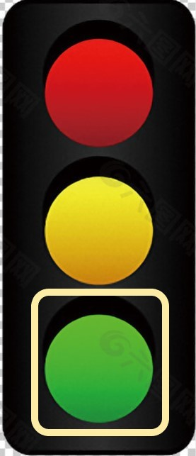

# BLE-weather-node-app

本app是一款基於ESP32的氣象站的接收端

app 在開啟時便會自動連線

app 需要花約6~9秒進行低功耗藍牙初始化設定

## 介面說明
---------------

使用瀏覽器打開說明頁面 

藍芽重新連縣 
## 數值單位說明
------------

### 溫度部分

由DHT22抓取數值°C

### 濕度部分

當下溫度的濕度飽和程度

### 空氣品質部分

MQ-135 0~3.3v 區間12-bit ADC值

## 圖示說明

------------

室內舒服溫濕度: 介於18 ~ 23度，45 ~ 65% 相對溼度

植物適宜溫濕度: 介於22 ~ 32度，60 ~ 80% 相對溼度

### 溫度部分

溫度高於28° 

溫度低於28°C 

### 濕度部分

濕度高於75% 

濕度低於75% 

### 空氣品質部分

小於200 

200到300 

300以上 